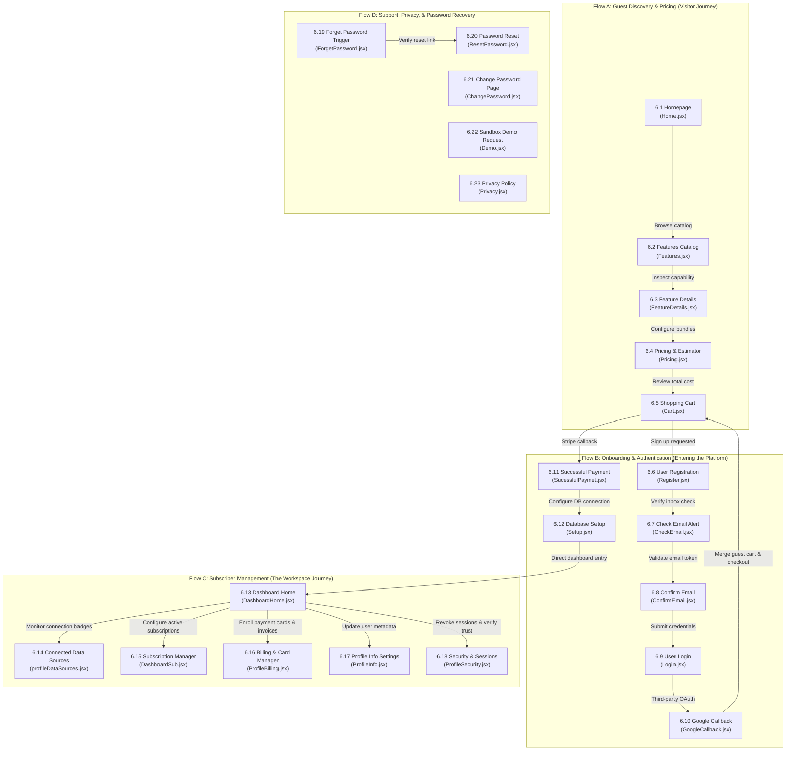
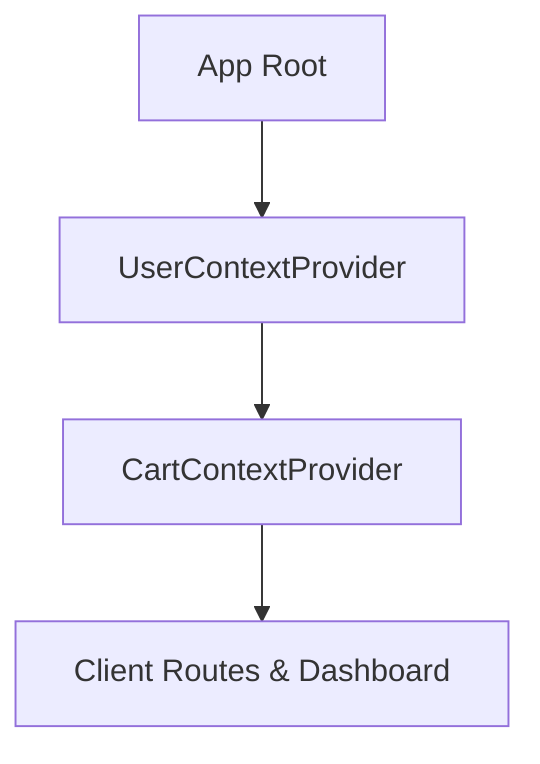

# Namaa — Client-Side React Application Documentation

Welcome to the official technical documentation for the client-side (user-facing) React application of the **Namaa** graduation project. This document serves as a complete reference for frontend developers, detailing the application's architecture, page-level user flows, global state providers, authentication workflows, and UI interactions to ensure a source-code-independent understanding of the system.

---

## 1. Project Overview

**Namaa** is a premium, AI-driven business analytics platform designed specifically for Small and Medium Businesses (SMBs). Its core mission is to empower business owners to extract actionable intelligence from their relational databases (such as SQL Server and PostgreSQL) using natural language querying and AI algorithms.

### Key Capabilities:
* **Interactive Pricing & Estimator**: Browse package tiers, select individual AI capabilities, fine-tune commitments, and perform real-time pricing calculations.
* **Onboarding & Database Setup**: Secure forms that guide users through linking their external databases with Namaa processing nodes.
* **Client Workspace Dashboard**: Displays token consumption metrics, active subscription terms, auto-renewal controls, and data synchronization health.
* **Billing & Account Management**: Manages secure credit card storage, invoice downloads, security sessions, and personal profiles.

---

## 2. Tech Stack & Dependencies

The application is built with **Vite** and uses **React 19**, styled using custom vanilla CSS modules and Bootstrap utilities.

| Category | Technology / Package | Version | Purpose |
| :--- | :--- | :--- | :--- |
| **Core UI** | React | `^19.1.1` | Component rendering, hooks, and lifecycle management |
| **Build & Tooling** | Vite | `^6.0.5` | Fast hot module replacement and optimized production bundler |
| **Routing** | React Router DOM | `^7.9.3` | Client-side routing, nested layouts, and route guards |
| **HTTP client** | Axios | `^1.12.2` | REST communication with token interception and automatic refresh |
| **Form Management** | Formik | `^2.4.6` | Form state tracking and submit wrappers |
| **Validation** | Yup | `^1.7.1` | Schema validation for database forms, login, and settings |
| **Layout Grid** | Bootstrap | `^5.3.8` | Responsive layout grid and baseline utilities |
| **Components Styling** | React Bootstrap | `^2.10.10` | Bootstrap components rewritten natively for React |
| **Icons** | Lucide React | `^0.563.0` | High-quality SVG icon set |
| **Toasts** | React Hot Toast | `^2.6.0` | Light, non-blocking toast notifications |
| **Modals / Prompts** | SweetAlert2 | `^11.26.x` | Stylized confirmation alerts and warning dialogs |
| **Loaders** | React Spinners | `^0.17.0` | UI locking loaders for async actions |
| **Charts** | ECharts | `^5.x` | Responsive visualization of token allocations and metrics |

---

## 3. Project Structure

The project directory isolates page views, layouts, global states, and network configuration:

```text
final-grad-app/src/
├── assets/                    # Static styling resources
│   ├── fonts/                 # Inter variable typeface families
│   └── images/                # Brand logs, background layouts, and illustrations
├── Components/                # Modular UI components grouped by workspace feature
│   ├── Cart/                  # Shopping cart estimator page and cost breakdown
│   ├── ChangePassword/        # Public recovery page
│   ├── CheckEmail/            # Email verification check reminder
│   ├── Complete/              # Onboarding step verification guide
│   ├── ConfirmEmail/          # Validation destination for email tokens
│   ├── DashboardHome/         # Workspace metric charts, services switches
│   ├── DashboardLayout/       # Sidebar layout template for client tools
│   ├── DashboardSub/          # Advanced subscription schedules and logs
│   ├── Demo/                  # Product trial request forms
│   ├── FeatureDetails/        # Technical descriptions of services and review widgets
│   ├── Features/              # AI services grid catalog
│   ├── Footer/                # Public landing page footer
│   ├── ForgetPassword/        # Email verification trigger forms
│   ├── GoogleCallback/        # OAuth authentication handling page
│   ├── Home/                  # Landing page, dynamic pricing, and reviews
│   ├── Layout/                # Public navigation wrapper and footer controller
│   ├── Login/                 # Traditional credentials submission
│   ├── NavBar/                # Shared header navigation component
│   ├── Pricing/               # 3D Bundles pricing carousel
│   ├── Privacy/               # Privacy policies
│   ├── ProfileBilling/        # Saved credit cards and transaction histories
│   ├── ProfileInfo/           # Basic metadata settings and notifications preferences
│   ├── ProfileLayout/         # Shell and sidebar wrapper for settings
│   ├── ProfileSecurity/       # Active devices logout and password updates
│   ├── ProfileSubscription/   # Profile plan indicator summary
│   ├── Protected/             # Session check wrapper (Route guard)
│   ├── Register/              # Account signups details collection
│   ├── ResetPassword/         # Validation destination for password tokens
│   ├── Setup/                 # Database credentials connector
│   └── SucessfulPaymet/       # Checkout landing landing page
├── context/                   # Global React Context providers
│   ├── userContext.jsx        # JWT tokens, authentication status, profile images
│   └── CartContext.jsx        # Custom item estimators state sync
├── utils/                     # Global utility functions
│   └── imageUrl.js            # URL builders resolving backend static directories
├── api.js                     # Central Axios client instance with silent refresh queues
├── App.jsx                    # Routing configuration mapping layouts and sub-routes
├── index.css                  # Typography, oklch design tokens, custom buttons
└── main.jsx                   # React bootstrapper registering contexts and router
```

---

## 4. Component Architecture

This section documents the non-page, structural UI components used as global layouts, navigation panels, route guards, or reusable cards. 

*(For global Context Providers, see **Section 8: State Management & Context Architecture**).*

### 4.1 Route Guards

#### Protected (`Protected.jsx`)
* **Category**: Route Guard
* **Purpose**: Restricts access to client workspace routes for unauthenticated users.
* **Props**:
  * `children` (React Node): The secure component to mount if authorized.
* **Internal State**: `None`
* **Behavior**: Reads `userToken` and `loading` states from `userContext`. If loading, renders a loader spinner; if authenticated, mounts `children`; if unauthorized, redirects the client to `/login`.
* **Used In**: Secure routes wrappers in `App.jsx`
* **Dependencies**: `react-router-dom`, `userContext`

### 4.2 Layout Components

#### Layout (`Layout.jsx`)
* **Category**: Layout Container
* **Purpose**: Serves as the primary public root container. Renders global branding headers, footers, and wraps around public marketing pages.
* **Props**: `None`
* **Internal State**: `None`
* **Behavior**: Displays `<NavBar />` at the top, inserts dynamic nested route pages inside a centered React Router `<Outlet />`, and mounts `<Footer />` at the bottom.
* **Used In**: Root routes in `App.jsx`
* **Dependencies**: `react-router-dom`, `NavBar`, `Footer`

#### DashboardLayout (`DashboardLayout.jsx`)
* **Category**: Layout Container
* **Purpose**: The main client workspace container shell. Renders sidebar panels and toggles navigation menus on small screens.
* **Props**: `None`
* **Internal State**:
  * `isSidebarOpen` (Boolean): Controls sidebar expansion states on mobile screen layouts.
* **Behavior**: Displays navigation selectors on the left side, active profile badges in the header, and details workspace modules inside `<Outlet />` on the right side.
* **Used In**: Dashboard protected sub-routes in `App.jsx`
* **Dependencies**: `react-router-dom`, `lucide-react`, `userContext`

#### ProfileLayout (`ProfileLayout.jsx`)
* **Category**: Layout Container
* **Purpose**: Parent sidebar wrapper for account settings sub-routes, managing avatar uploads and sign-out processes.
* **Props**: `None`
* **Internal State**:
  * `userData` (Object): Local cache of active settings profile.
  * `loading` (Boolean): Form spinner indicator.
* **Behavior**:
  * Fetches user profile on mount.
  * Clicking the avatar selects a image file, converts it via `FileReader`, and uploads it as `multipart/form-data`.
  * Renders setting sub-pages inside `<Outlet />`.
* **Used In**: Settings nested routes in `App.jsx`
* **Dependencies**: `react-router-dom`, `userContext`, `api`, `toast`

#### NavBar (`NavBar.jsx`)
* **Category**: Navigation Panel
* **Purpose**: Top header navigation showing branding logs, public page selectors, active cart count, and user control dropdowns.
* **Props**: `None`
* **Internal State**:
  * `isMenuOpen` (Boolean): Collapses nav elements on mobile screens.
* **Behavior**: Monitors the global authentication state from `userContext` to display user profiles or show login actions, and reads items count from `CartContext`.
* **Used In**: `Layout`
* **Dependencies**: `react-router-dom`, `userContext`, `CartContext`

#### Footer (`Footer.jsx`)
* **Category**: Static Layout
* **Purpose**: Standard bottom footer providing links, branding assets, copyright strings, and social icons.
* **Props**: `None`
* **Internal State**: `None`
* **Behavior**: Renders static styling links grids.
* **Used In**: `Layout`
* **Dependencies**: `react-router-dom`

### 4.3 Shared / Reusable UI Components

#### ProfileSubscription (`ProfileSubscription.jsx`)
* **Category**: Reusable UI Card
* **Purpose**: Renders active subscription status summaries, charge notifications, and features tables inside settings views.
* **Props**: `None`
* **Internal State**: `None`
* **Behavior**: Renders a details dashboard, and navigates clients to `/pricing` upon clicking "Upgrade Plan".
* **Used In**: Profile settings panels
* **Dependencies**: `react-router-dom`

#### Complete (`Complete.jsx`)
* **Category**: Reusable UI Card
* **Purpose**: Shows onboarding checkout status indicators and guides new users to databases credentials setups.
* **Props**: `None`
* **Internal State**:
  * `completeData` (Array): Lists recently purchased services.
* **Behavior**: Fetches transaction lists on mount, lists completed payment checkmarks, and offers a button to navigate to `/Setup-page`.
* **Used In**: Onboarding views (`/complete-data`)
* **Dependencies**: `react-router-dom`, `userContext`, `api`, `toast`

---

## 5. Client-Side Routing Structure

The application maps route paths to page components using `createBrowserRouter` in `App.jsx`.

| Path | Access Level | Target Page Component (in Section 6) |
| :--- | :--- | :--- |
| `/` or `/home` | Public | 6.1 Homepage (`Home.jsx`) |
| `/features` | Public | 6.2 Features Catalog (`Features.jsx`) |
| `/feature-details/:id` | Public | 6.3 Feature Details (`FeatureDetails.jsx`) |
| `/pricing` | Public | 6.4 Pricing & Bundles Constructor (`Pricing.jsx`) |
| `/cart` | Public | 6.5 Shopping Cart (`Cart.jsx`) |
| `/register` | Public | 6.6 User Registration (`Register.jsx`) |
| `/check-email` | Public | 6.7 Check Email Alert (`CheckEmail.jsx`) |
| `/confirm-email` | Public | 6.8 Confirm Email (`ConfirmEmail.jsx`) |
| `/login` | Public | 6.9 User Login (`Login.jsx`) |
| `/google/callback` | Public | 6.10 Google Callback (`GoogleCallback.jsx`) |
| `/success-payment` | Public | 6.11 Successful Payment (`SucessfulPaymet.jsx`) |
| `/Setup-page` | Public | 6.12 Database Setup (`Setup.jsx`) |
| `/dashboard/home` | Protected | 6.13 Dashboard Home (`DashboardHome.jsx`) |
| `/dashboard/data-sources`| Protected | 6.14 Connected Data Sources (`profileDataSources.jsx`) |
| `/dashboard/subscription`| Protected | 6.15 Subscription Manager (`DashboardSub.jsx`) |
| `/dashboard/billing` | Protected | 6.16 Billing & Card Manager (`ProfileBilling.jsx`) |
| `/profile/info` | Protected | 6.17 Profile Info Settings (`ProfileInfo.jsx`) |
| `/dashboard/security` | Protected | 6.18 Security & Sessions (`ProfileSecurity.jsx`) |
| `/forget-password` | Public | 6.19 Forget Password Trigger (`ForgetPassword.jsx`) |
| `/reset-password` | Public | 6.20 Password Reset (`ResetPassword.jsx`) |
| `/change-password` | Public | 6.21 Change Password Page (`ChangePassword.jsx`) |
| `/demo` | Public | 6.22 Sandbox Demo Request (`Demo.jsx`) |
| `/privacy` | Public | 6.23 Privacy Policy (`Privacy.jsx`) |

---

## 6. Page-by-Page Walkthroughs & User Flows

This section details every page component, mapping its purpose, layout design, internal states, behavioral logic, data inputs, and user journey steps.



---

### Flow A: Guest Discovery & Pricing (Visitor Journey)

#### 6.1 Homepage (`Home.jsx`)
* **Purpose**: Serves as the primary public entry point introducing Namaa, categories, and testimonials.
* **Route**: `/home` or `/`
* **Props / Internal State (technical)**:
  * `Props`: None
  * `reviews` (Array): Testimonial reviews fetched on mount.
  * `activeCategoryIndex` (Number): Tracks active service category tabs.
* **Layout & Sections (UX)**:
  * Hero banner with glowing gradients.
  * Categories navigation bar with service cards.
  * Client reviews marquee area.
* **Behavior (technical)**:
  * Fetch reviews on mount. If `reviews.length > 3`, duplicates the array to animate a continuous CSS horizontal marquee scrolling loop.
  * Tab click triggers class changes for smooth element fade-ins.
* **Data Displayed & API calls involved**:
  * Hits `GET /Reviews/landing-page` on mount.
  * Renders names, ratings, text, and avatars.
* **User Interactions & States Handled**:
  * **Loading**: Marquee remains empty until API resolves.
  * **Error**: Catches errors in console without breaking the page.
* **User Flow**:
  1. User lands on page and views testimonials.
  2. Clicks service category tabs to check details.
  3. Clicks "Explore Features" link to go to Features Catalog.
* **Dependencies**: `react-router-dom`, `api`

#### 6.2 Features Catalog (`Features.jsx`)
* **Purpose**: Lists all available AI services.
* **Route**: `/features`
* **Props / Internal State (technical)**:
  * `Props`: None
  * `services` (Array): Catalog services list.
  * `searchTerm` (String): Search filter keyword.
* **Layout & Sections (UX)**:
  * Grid directory of service cards with title, description, and price badge.
  * Top filter bar with search inputs.
* **Behavior (technical)**:
  * Fetches services on mount.
  * Uses clientside filter rules to filter `services` array by `searchTerm`.
* **Data Displayed & API calls involved**:
  * Calls `GET /Services` on mount.
  * Renders service items.
* **User Interactions & States Handled**:
  * Displays a loading state until search resolves.
* **User Flow**:
  1. User browses card lists.
  2. Types search filter keyword.
  3. Clicks card to go to Feature Details.
* **Dependencies**: `react-router-dom`, `api`

#### 6.3 Feature Details (`FeatureDetails.jsx`)
* **Purpose**: Detailed specification sheet for a selected service.
* **Route**: `/feature-details/:id`
* **Props / Internal State (technical)**:
  * `Props`: None
  * `featureData` (Object): Caches loaded service details.
  * `loading` (Boolean): Page-load spinner toggle.
* **Layout & Sections (UX)**:
  * Left Column: Spec sheets (token limits, response times).
  * Right Column: Checklists, Use Cases, reviews.
* **Behavior (technical)**:
  * Extract `id` from path parameters.
  * Fetches service spec details on mount.
* **Data Displayed & API calls involved**:
  * Hits `GET /Services/${id}` on mount.
* **User Interactions & States Handled**:
  * **Loading**: Renders page loader overlay if `loading` is true.
* **User Flow**:
  1. User reads benefits checklists.
  2. Clicks "See Pricing" to go to Pricing packages constructor.
* **Dependencies**: `react-router-dom`, `api`

#### 6.4 Pricing & Bundles Constructor (`Pricing.jsx`)
* **Purpose**: Plan comparer and custom services calculator.
* **Route**: `/pricing`
* **Props / Internal State (technical)**:
  * `Props`: None
  * `packages` (Array): Standard pricing tiers.
  * `activePlanIndex` (Number): Dynamic center plan item in 3D carousel.
  * `selectedCustomServices` (Array): Chosen individual services.
* **Layout & Sections (UX)**:
  * Top: 3D packages carousel cards.
  * Bottom: Customizable services checklist.
* **Behavior (technical)**:
  * Left/Right arrows shift carousel active cards, applying CSS scale-up transitions.
  * Cart add action saves details to context cart values.
* **Data Displayed & API calls involved**:
  * Hits `GET /Packages` (packages) and `GET /Services/cards` (estimator list).
* **User Interactions & States Handled**:
  * Updates item counts badge in navbar dynamically.
* **User Flow**:
  1. User compares package options in 3D carousel.
  2. Toggles services checkbox add-ons.
  3. Clicks cart icon button to review selections.
* **Dependencies**: `react-router-dom`, `userContext`, `CartContext`, `api`

#### 6.5 Shopping Cart (`Cart.jsx`)
* **Purpose**: Pro-rated cost calculator and checkout interface.
* **Route**: `/cart`
* **Props / Internal State (technical)**:
  * `Props`: None
  * `promoCode` (String): Coupon input value.
  * `discountPercentage` (Number): Coupon percentage discounts.
* **Layout & Sections (UX)**:
  * Left: Cart items checklist with duration and token count dropdown selectors.
  * Right: Pro-rated receipts summary box.
* **Behavior (technical)**:
  * Cart calculations run on client: `Monthly = Base Duration + Selected Token Cost`.
  * Guest items in local storage merge to database cart on login.
* **Data Displayed & API calls involved**:
  * Hitting `GET /Cart` to list items.
  * Hitting `GET /Orders/discount-codes/validate?code=${promoCode}` to validate codes.
  * Hitting `POST /Orders/services` to checkout.
* **User Interactions & States Handled**:
  * Proceeds to payment. Locks page with loading spinners, redirecting user to Stripe payment portal.
* **User Flow**:
  1. Adjusts commitment duration, token limits.
  2. Applies discount coupons.
  3. Clicking checkout redirects to Stripe.
* **Dependencies**: `react-router-dom`, `userContext`, `CartContext`, `api`, `toast`

---

### Flow B: Onboarding & Authentication (Entering the Platform)

#### 6.6 User Registration (`Register.jsx`)
* **Purpose**: Creates new user credentials.
* **Route**: `/register`
* **Props / Internal State (technical)**:
  * `Props`: None
* **Layout & Sections (UX)**:
  * Split screen: Branding layout left, registration fields right.
* **Behavior (technical)**:
  * Yup validates inputs: Name, Email format, Password strength.
* **Data Displayed & API calls involved**:
  * Hits `POST /Auth/register`.
* **User Interactions & States Handled**:
  * Disables buttons on submits.
* **User Flow**:
  1. User enters signup fields.
  2. Submits details.
  3. System registers account and redirects client to `/check-email`.
* **Dependencies**: `react-router-dom`, `api`, `toast`

#### 6.7 Check Email Alert (`CheckEmail.jsx`)
* **Purpose**: Instructs user to check email inboxes.
* **Route**: `/check-email`
* **Props / Internal State (technical)**:
  * `Props`: None
* **Layout & Sections (UX)**:
  * Centered layout showing illustration assets.
* **Behavior (technical)**: Static page.
* **Data Displayed & API calls involved**: `None`
* **User Interactions & States Handled**:
  * Offers button redirecting user to login page.
* **User Flow**:
  1. User reads details.
  2. Opens mail link.
* **Dependencies**: `react-router-dom`

#### 6.8 Confirm Email (`ConfirmEmail.jsx`)
* **Purpose**: Processes verification token validation.
* **Route**: `/confirm-email`
* **Props / Internal State (technical)**:
  * `Props`: None
  * `status` (String): Track validation status ('verifying', 'success', 'error').
* **Layout & Sections (UX)**:
  * Centered validation card with status indicators.
* **Behavior (technical)**:
  * Mount extracts `UserId` and `Token` from URL search queries.
  * Validation endpoint returns status checks.
* **Data Displayed & API calls involved**:
  * Hits `POST /ConfirmEmail` with verification payload.
* **User Interactions & States Handled**:
  * Success redirects user to `/login` after 3 seconds.
* **User Flow**:
  1. Redirect from email land here.
  2. Validation finishes, redirecting client to login page.
* **Dependencies**: `react-router-dom`, `api`

#### 6.9 User Login (`Login.jsx`)
* **Purpose**: Enters email/password or Google OAuth to sign in.
* **Route**: `/login`
* **Props / Internal State (technical)**:
  * `Props`: None
* **Layout & Sections (UX)**:
  * Centered card layout with inputs and Google buttons.
* **Behavior (technical)**:
  * Yup validates inputs.
  * Google OAuth link passes redirect flows parameters.
* **Data Displayed & API calls involved**:
  * Hits `POST /Auth` with credentials payload.
* **User Interactions & States Handled**:
  * Displays backend error alerts.
* **User Flow**:
  1. User enters details or clicks Google button.
  2. Updates context access tokens.
* **Dependencies**: `react-router-dom`, `userContext`, `api`, `toast`

#### 6.10 Google Callback (`GoogleCallback.jsx`)
* **Purpose**: Callback processing page for third-party OAuth logins.
* **Route**: `/google/callback`
* **Props / Internal State (technical)**:
  * `Props`: None
* **Layout & Sections (UX)**:
  * Centered page with loading wheel indicators.
* **Behavior (technical)**:
  * Extracts code and state fields from URL.
  * Checks if registration or login redirect path matches.
* **Data Displayed & API calls involved**:
  * Hits `POST /Auth/google/login` or `POST /Auth/google/register`.
* **User Interactions & States Handled**:
  * Redirects user back to initial cart.
* **User Flow**:
  1. Google verification handles logins.
  2. Context variables update and redirect user.
* **Dependencies**: `react-router-dom`, `userContext`, `api`

#### 6.11 Successful Payment (`SucessfulPaymet.jsx`)
* **Purpose**: Stripe return page.
* **Route**: `/success-payment`
* **Props / Internal State (technical)**:
  * `Props`: None
* **Layout & Sections (UX)**:
  * Checkout success details boxes.
* **Behavior (technical)**: Static display.
* **Data Displayed & API calls involved**: None
* **User Interactions & States Handled**: Success checks.
* **User Flow**:
  1. User returns from Stripe checkout.
  2. Clicks button to go setup database configurations.
* **Dependencies**: `react-router-dom`

#### 6.12 Database Setup (`Setup.jsx`)
* **Purpose**: Secure onboarding form connecting user database files.
* **Route**: `/Setup-page`
* **Props / Internal State (technical)**:
  * `Props`: None
  * `databaseTypes` (Array): Supported database types.
  * `loading` (Boolean): Form spinner.
* **Layout & Sections (UX)**:
  * Centered inputs list card (Host, Port, Credentials).
* **Behavior (technical)**:
  * Formik and Yup validate connection credential configurations.
* **Data Displayed & API calls involved**:
  * Hits `GET /UserDatabaseCredentials/database-types` on mount.
  * Hits `POST /UserDatabaseCredentials` on submit.
* **User Interactions & States Handled**:
  * Shows toast error notifications for bad ports/addresses.
* **User Flow**:
  1. User selects database engine type.
  2. Enters connection details and submits.
  3. Redirects user to Connected Data Sources.
* **Dependencies**: `react-router-dom`, `userContext`, `api`, `toast`

---

### Flow C: Subscriber Management (The Workspace Journey)

#### 6.13 Dashboard Home (`DashboardHome.jsx`)
* **Purpose**: Core analytics view showing metrics.
* **Route**: `/dashboard/home`
* **Props / Internal State (technical)**:
  * `Props`: None
  * `tokenData` (Array): Charts points data.
  * `dbConnectionStatus` (String): Connection validation health status.
* **Layout & Sections (UX)**:
  * Expiry warning bars, token usage charts, active tools list.
* **Behavior (technical)**:
  * Usage charts render using ECharts wrapper logic.
* **Data Displayed & API calls involved**:
  * Hits `GET /Users/profile` and `GET /Billing/upcoming-payments`.
* **User Interactions & States Handled**:
  * Shows active tool toggles.
* **User Flow**:
  1. User reviews metrics.
  2. Accesses settings via sidebar navigation.
* **Dependencies**: `react-router-dom`, `userContext`, `api`, `echarts`

#### 6.14 Connected Data Sources (`profileDataSources.jsx`)
* **Purpose**: Displays connection configurations.
* **Route**: `/dashboard/data-sources`
* **Props / Internal State (technical)**:
  * `Props`: None
  * `credentials` (Object): Active database credentials.
  * `showPassword` (Boolean): Toggles password mask.
* **Layout & Sections (UX)**:
  * Credentials card with Active, Pending, or Inactive status badges.
* **Behavior (technical)**:
  * Password mask toggles via eye icon clicks.
* **Data Displayed & API calls involved**:
  * Hits `GET /UserDatabaseCredentials/decrypted` on mount.
* **User Interactions & States Handled**: Password visibility toggles.
* **User Flow**:
  1. User monitors connection status badges.
  2. Inspects database credentials configuration.
* **Dependencies**: `react-router-dom`, `userContext`, `api`

#### 6.15 Subscription Manager (`DashboardSub.jsx`)
* **Purpose**: Manages active subscriptions, auto-renewals, and scheduling upgrades.
* **Route**: `/dashboard/subscription`
* **Props / Internal State (technical)**:
  * `Props`: None
  * `subscriptionPlans` (Object): Plan specifications.
  * `autoRenewMap` (Object): Auto-renew switches status.
* **Behavior (technical)**:
  * Auto-renew uses optimistic UI state variables, and resets if server calls fail.
  * SweetAlert2 dialog prompts confirm cancellations.
* **Data Displayed & API calls involved**:
  * Hits `GET /ClientSubscriptions/my-plan`.
  * Calls renew endpoints `PUT /ClientSubscriptions/standard-package-auto-renewal-toggle/${id}`.
* **User Interactions & States Handled**: Optimistic toggles.
* **User Flow**:
  1. User reviews billing cycle.
  2. Schedules package change.
* **Dependencies**: `react-router-dom`, `userContext`, `api`, `sweetalert2`, `toast`

#### 6.16 Billing & Card Manager (`ProfileBilling.jsx`)
* **Purpose**: Card settings and invoices history tables.
* **Route**: `/dashboard/billing`
* **Props / Internal State (technical)**:
  * `Props`: None
  * `savedCards` (Array): Credit card details.
  * `invoiceHistory` (Array): Paid transaction invoice items.
* **Layout & Sections (UX)**:
  * Left: Payment methods credit cards view.
  * Right: Invoice table with PDF invoice details.
* **Behavior (technical)**:
  * Clicking "Add Card" opens Stripe billing page in new tab.
  * Confirmation boxes protect delete card actions.
* **Data Displayed & API calls involved**:
  * Hits `GET /SavedCards` and `GET /Billing/invoice-history`.
* **User Interactions & States Handled**: SweetAlert2 dialog confirmations.
* **User Flow**:
  1. Adds credit card.
  2. Toggles default options.
  3. Downloads invoice PDF logs.
* **Dependencies**: `react-router-dom`, `userContext`, `api`, `sweetalert2`, `toast`

#### 6.17 Profile Info Settings (`ProfileInfo.jsx`)
* **Purpose**: Manages basic user profile properties and notification settings.
* **Route**: `/profile/info`
* **Props / Internal State (technical)**:
  * `Props`: None
  * `isEditing` (Boolean): Form fields toggle.
* **Behavior (technical)**:
  * Save details formats payload as `multipart/form-data`.
  * Communication switches change events debounced by 500ms.
* **Data Displayed & API calls involved**:
  * Hits `GET /Users/profile` and notifications endpoints.
* **User Interactions & States Handled**: Debounces network requests.
* **User Flow**:
  1. User toggles Edit mode.
  2. Modifies profile settings details.
  3. Submits changes.
* **Dependencies**: `react-router-dom`, `userContext`, `api`

#### 6.18 Security & Sessions (`ProfileSecurity.jsx`)
* **Purpose**: Active session terminations and device trust verifications.
* **Route**: `/dashboard/security`
* **Props / Internal State (technical)**:
  * `Props`: None
  * `activeSessions` (Array): Active session items.
* **Layout & Sections (UX)**:
  * Top: Password change Form.
  * Bottom: Devices list table (Browser, OS, Location, IP, Trust Badge).
* **Behavior (technical)**:
  * Clicking "Trust Device" sends email confirmation token.
* **Data Displayed & API calls involved**:
  * Hits `GET /UserSessions` and session delete endpoints.
* **User Interactions & States Handled**: Revocation controls.
* **User Flow**:
  1. Reviews devices session table.
  2. Terminate specific active session.
* **Dependencies**: `react-router-dom`, `userContext`, `api`, `sweetalert2`, `toast`

---

### Flow D: Support, Privacy, & Password Recovery

#### 6.19 Forget Password Trigger (`ForgetPassword.jsx`)
* **Purpose**: Recovery email forms.
* **Route**: `/forget-password`
* **Props / Internal State (technical)**:
  * `Props`: None
* **Behavior (technical)**: Validates input email address format.
* **Data Displayed & API calls involved**:
  * Hits `POST /Auth/forget-password`.
* **User Flow**:
  1. Enters email address.
  2. Submits form, redirecting client to `/check-email`.
* **Dependencies**: `react-router-dom`, `api`, `toast`

#### 6.20 Password Reset (`ResetPassword.jsx`)
* **Purpose**: Resets password using tokens.
* **Route**: `/reset-password`
* **Props / Internal State (technical)**:
  * `Props`: None
* **Behavior (technical)**: Extracts tokens from URL queries and validates complexity.
* **Data Displayed & API calls involved**:
  * Hits `POST /Auth/reset-password`.
* **User Flow**:
  1. Enters new password details.
  2. Submits changes and redirects user to `/login`.
* **Dependencies**: `react-router-dom`, `api`, `toast`

#### 6.21 Change Password Page (`ChangePassword.jsx`)
* **Purpose**: Simple password change interface.
* **Route**: `/change-password`
* **Props / Internal State (technical)**:
  * `Props`: None
* **Behavior (technical)**: Validates old/new inputs.
* **Data Displayed & API calls involved**:
  * Hits `PUT /Accounts/change-password`.
* **User Flow**:
  1. Submits new password details.
* **Dependencies**: `react-router-dom`, `api`

#### 6.22 Sandbox Demo Request (`Demo.jsx`)
* **Purpose**: custom sandbox trials form.
* **Route**: `/demo`
* **Props / Internal State (technical)**:
  * `Props`: None
* **Behavior (technical)**: Formik collects organization fields and submits them.
* **Data Displayed & API calls involved**:
  * Custom email submit endpoints.
* **User Flow**:
  1. Submits organizational requirements.
* **Dependencies**: `react-router-dom`, `api`

#### 6.23 Privacy Policy (`Privacy.jsx`)
* **Purpose**: Static terms page.
* **Route**: `/privacy`
* **Props / Internal State (technical)**:
  * `Props`: None
* **Behavior (technical)**: Static layout render.
* **Dependencies**: `react-router-dom`

---

## 7. Authentication & Security Flows

Authentication is centered around JSON Web Tokens (JWT) stored in the browser and updated silently during sessions.

### 7.1 Google OAuth Callback Pipeline
Integrated via the `GoogleCallback.jsx` component to handle third-party login results:
1. **State Decoding**: On mount, it parses `code` and `state` parameters from `window.location.search`.
2. **Context Resolution**: The `state` parameter contains a colon-separated string: `<flow>:<redirectPath>` (e.g. `login:/cart` or `register:/home`).
3. **API Handshake**:
   - If the flow is registration, it calls `POST /Auth/google/register`.
   - If the flow is login, it calls `POST /Auth/google/login`.
   - The payload contains the authorization `code` and a matching `redirectUri`.
4. **Session Activation**: On success, it writes the returned JWT to `localStorage`, updates the `userContext` state, and redirects the user to the encoded `redirectPath`.

### 7.2 Axios Interceptors and Silent Token Refresh
The Axios configuration in `src/api.js` manages authorization headers and automatic token updates:
* **Request Interceptor**: Automatically injects `Authorization: Bearer <token>` into outgoing headers if a token exists in `localStorage`.
* **Response Interceptor & Silent Refresh**:
  * Detects `401 Unauthorized` responses.
  * If a refresh process is not already running, it flags `isRefreshing = true` and calls `POST /Auth/refresh`, passing the stored refresh token.
  * While the refresh request is active, other failing requests are added to a `failedQueue` array.
  * **Success Handler**: Resolves the `failedQueue` with the new token, replays the requests, and updates `localStorage`.
  * **Failure Handler**: Clears the queue, removes tokens from `localStorage`, resets contexts, and redirects the user to `/login`.

---

## 8. State Management & Context Architecture

The application uses the React Context API to manage global states for authentication and shopping carts.



### 8.1 `UserContext` (`src/context/userContext.jsx`)
Manages authentication states, credentials, and profile image caching.
* **State Variables**:
  * `userToken` (String): The active JWT token.
  * `loading` (Boolean): App-level initialization indicator.
  * `userEmail` (String): The logged-in user's email address.
  * `userProfileImage` (String): The path to the user's avatar.
* **Exported Functions**:
  * `setUserToken(token)`: Updates the current access token.
  * `setUserProfileImage(path)`: Updates the avatar path.
  * `fetchProfile()`: Re-queries user profile information.

### 8.2 `CartContext` (`src/context/CartContext.jsx`)
Manages shopping cart items, item counts, and synchronization between guest and logged-in states.
* **State Variables**:
  * `cartvalue` (Array): Selected service items currently in the cart.
  * `cartCount` (Number): The total number of items in the cart.
* **Exported Functions**:
  * `getCart()`: Re-queries the cart items. If the user is logged in, it fetches items from the backend API. If a guest, it reads from `localStorage`.
  * `setcartvalue(val)`: Direct cart value mutator.

---

## 9. API Integration

This section lists all backend endpoints consumed by the client-side React application, grouped by feature area.

| Feature Area | Endpoint | Method | Purpose | Triggered By |
| :--- | :--- | :--- | :--- | :--- |
| **Auth** | `/Auth` | `POST` | Authenticates email/password | Submit login form |
| **Auth** | `/Auth/register` | `POST` | Creates a new user account | Submit signup form |
| **Auth** | `/Auth/sign-out` | `POST` | Invalidates active user session | Click profile logout button |
| **Auth** | `/Auth/refresh` | `POST` | Exchanges refresh token for new access JWT | Auto-triggered on 401 errors |
| **Auth** | `/Auth/google/login` | `POST` | Resolves Google credentials on login | OAuth redirect callback |
| **Auth** | `/Auth/google/register` | `POST` | Resolves Google credentials on signup | OAuth redirect callback |
| **Auth** | `/Auth/forget-password` | `POST` | Sends a recovery email link | Submit forget password form |
| **Auth** | `/Auth/reset-password` | `POST` | Updates password with token codes | Submit reset password form |
| **Auth** | `/Accounts/change-password` | `PUT` | Updates active profile passwords | Submit change password settings |
| **Auth** | `/ConfirmEmail` | `POST` | Confirms user email verification | Confirm email page loads |
| **Profile** | `/Users/profile` | `GET` | Fetches active user configuration details | Global auth context init |
| **Profile** | `/Users/profile` | `PUT` | Updates profile name, numbers, or avatar | Submit profile settings / avatar file |
| **Profile** | `/Users/profile/notifications` | `GET` | Fetches email notification permissions | ProfileInfo settings load |
| **Profile** | `/Users/profile/toggle-products-updates-notification` | `PUT` | Toggles product update emails | Flip updates switch (debounced) |
| **Profile** | `/Users/profile/toggle-billing-notification` | `PUT` | Toggles invoice and fee emails | Flip billing switch (debounced) |
| **Sessions** | `/UserSessions` | `GET` | Lists active logins and locations | ProfileSecurity settings load |
| **Sessions** | `/UserSessions/${id}` | `DELETE` | Revokes specific devices sessions | Click "Sign Out" device row |
| **Sessions** | `/UserSessions/others` | `DELETE` | Revokes all sessions except current device | Click "Sign Out of Other Devices" |
| **Sessions** | `/UserSessions/${id}/trust` | `PUT` | Sends security verification email | Click "Trust this device" link |
| **Sessions** | `/UserSessions/verify-trust` | `PUT` | Confirms device trust approval codes | Return link challenge verification |
| **Database** | `/UserDatabaseCredentials` | `POST` | Connects connection endpoints | Submit Setup onboarding form |
| **Database** | `/UserDatabaseCredentials/decrypted` | `GET` | Fetches stored credentials | profileDataSources details load |
| **Database** | `/UserDatabaseCredentials/database-types` | `GET` | Fetches supported engine types dropdown | Setup database page load |
| **Pricing/Cart** | `/Packages` | `GET` | Fetches available standard pricing tiers | Pricing catalog load |
| **Pricing/Cart** | `/Services` | `GET` | Fetches available service categories | Home page tab load |
| **Pricing/Cart** | `/Services/cards` | `GET` | Fetches detailed feature selections | Custom estimator grid load |
| **Pricing/Cart** | `/Cart` | `GET` | Fetches items currently in the cart | CartContext initialization |
| **Pricing/Cart** | `/Cart` | `POST` | Adds individual capabilities to cart | Click "Add to Estimate" |
| **Pricing/Cart** | `/Cart/${id}` | `DELETE` | Removes service items from cart | Click delete cart item |
| **Pricing/Cart** | `/Orders/discount-codes/validate` | `GET` | Validates coupon validation codes | Click checkout apply promo |
| **Pricing/Cart** | `/Orders/services` | `POST` | Registers checkouts and orders | Click "Proceed to Payment" |
| **Pricing/Cart** | `/Orders/last-services` | `GET` | Fetches recently purchased services | Onboarding welcome page load |
| **Pricing/Cart** | `/Orders/package-change/${subId}/${packId}` | `POST` | Initiates immediate plan updates | Click change plan "Now" |
| **Subscriptions**| `/ClientSubscriptions/my-plan` | `GET` | Fetches active subscription plans | Subscription management load |
| **Subscriptions**| `/ClientSubscriptions/cancel-standard-package/${id}` | `PUT` | Cancels subscription auto-renewals | Confirm cancel dialog |
| **Subscriptions**| `/ClientSubscriptions/reactivate-standard-package/${id}` | `PUT` | Resumes cancelled subscriptions | Click resume renewals |
| **Subscriptions**| `/ClientSubscriptions/terminate-standard-package/${id}` | `PUT` | Stops active plan immediately | Click end subscription now |
| **Subscriptions**| `/ClientSubscriptions/standard-package-auto-renewal-toggle/${id}` | `PUT` | Toggles subscription auto-renewals | Flip auto-renew switch |
| **Subscriptions**| `/ClientSubscriptions/schedule-new-standard-package/${subId}/${packId}` | `PUT` | Schedules plan updates | Click change plan "Later" |
| **Subscriptions**| `/ClientSubscriptions/available-services-for-customized-plan` | `GET` | Lists customized plan features | DashboardSub custom user load |
| **Billing** | `/SavedCards` | `GET` | Lists enrolled credit cards | ProfileBilling panel loads |
| **Billing** | `/SavedCards/enroll` | `POST` | Fetches secure Stripe card setup links | Click "Add new payment card" |
| **Billing** | `/SavedCards/${id}` | `DELETE` | Removes saved payment cards | Confirm delete card dialog |
| **Billing** | `/SavedCards/${id}/set-default` | `PUT` | Selects primary cards | Click card default radio options |
| **Billing** | `/Billing/invoice-history` | `GET` | Lists previous transaction histories | ProfileBilling transaction table |
| **Billing** | `/Billing/upcoming-payments` | `GET` | Lists next invoice payment dates | ProfileBilling details loads |
| **Reviews** | `/Reviews/landing-page` | `GET` | Fetches landing testimonials | Home page reviews load |
| **Reviews** | `/Reviews/package/${id}` | `GET` | Fetches plan specific reviews | Pricing plan change load |

---

## 10. UI/UX Design System

The application features a dark theme styled with custom vanilla CSS modules (`*.module.css`) to prevent class collisions.

### 10.1 Color Palette (oklch)
Design variables are registered globally in `src/index.css`:
* **Background Gradient**: Deep blue-violet to dark slate.
* **Primary Accents**: Royal Purple `oklch(0.45 0.1 250)`.
* **Success States**: Emerald Green `oklch(0.6 0.15 140)`.
* **Warning States**: Ochre Gold `oklch(0.7 0.15 80)`.
* **Destructive States**: Crimson Red `oklch(0.57 0.24 27)`.

### 10.2 Typography
* **Primary Font**: **Inter** variable font imported locally (`src/assets/fonts/Inter-VariableFont_opsz,wght.ttf`) for clean, modern readability.
* **Weights**: 400 (Regular), 500 (Medium), 600 (Semi-Bold), 700 (Bold).

### 10.3 UX Interactions
* **Dynamic Hover States**: Interactive cards lift and expand (`transform: translateY(-4px)`) with subtle box shadows.
* **Micro-Animations**: Toggle switches, carousels, and loading overlays use CSS transitions (`all 0.3s ease`).
* **Visual Banners**: Critical alerts use SweetAlert2 confirmations before performing destructive actions (like removing cards or cancelling plans).

---

## 11. Setup & Local Development

Follow these steps to run the application in a local development environment.

### Prerequisites
* **Node.js**: `v18.x` or `v20.x`
* **npm**: `v9.x` or above

### Installation
1. Navigate to the project root directory:
   ```bash
   cd final-grad-app
   ```
2. Install the package dependencies:
   ```bash
   npm install
   ```

### Configuration
Create a `.env` file in the root directory to define the API base URL:
```env
VITE_API_BASE_URL=/api
```

### Development Execution
Start the Vite local development server:
```bash
npm run dev
```
*The local development server runs at `http://localhost:5173/`.*

### Production Build
Build and optimize the application for production deployment:
```bash
npm run build
```
*This outputs optimized, minified, and hashed assets to the `dist/` directory, ready to be deployed to static hosting providers.*

---

## 12. Deployment (Vercel)

The client application is optimized for deployment to **Vercel** as a static Single Page Application (SPA).

### 12.1 Wildcard Rewrites (`vercel.json`)
To support client-side history routing (React Router) and prevent `404 Not Found` errors when users directly reload dashboard paths, a `vercel.json` file must be present in the project root directory containing:

```json
{
  "rewrites": [
    { "source": "/(.*)", "destination": "/index.html" }
  ]
}
```

* **Purpose**: Reroutes all direct navigation requests back to the entry point (`index.html`) so React Router can process the path client-side.

### 12.2 Step-by-Step Deployment Process
1. Push your local workspace changes to a Git repository (GitHub, GitLab, or Bitbucket).
2. Log in to your Vercel Dashboard and click **Add New** > **Project**.
3. Import the repository matching the workspace.
4. Configure the **Build & Development Settings**:
   * **Framework Preset**: Vite
   * **Build Command**: `npm run build`
   * **Output Directory**: `dist`
5. Configure the **Environment Variables**:
   * Add `VITE_API_BASE_URL` with your production API backend endpoint (e.g., `https://api.deeb-ai.com`).
6. Click **Deploy**. Vercel will build the bundles, optimize files, and generate live hosting links.

---

## 13. Browser & Device Support

The application is thoroughly tested and optimized to maintain aesthetic visual quality, animations speed, and inputs responsiveness across modern platforms.

### 13.1 Supported Web Browsers
* **Google Chrome**: Version 105 and above (Full OKLCH colors support).
* **Apple Safari**: Version 15.4 and above.
* **Mozilla Firefox**: Version 110 and above.
* **Microsoft Edge**: Version 105 and above.

### 13.2 Responsive Screen Breakpoints
Styles are mapped using CSS flexbox grids and responsive breakpoints to guarantee seamless rendering:

* **Mobile Devices**: `320px` to `480px` (Cards stack vertically, side menu collapses, top nav links hide behind mobile menus).
* **Tablets**: `481px` to `768px` (Split column structures adapt, analytics charts resize).
* **Laptops & Desktops**: `769px` to `1024px` (Full dashboards columns side-by-side).
* **Widescreen Displays**: `1025px` and above (Grid container max-widths capped to maintain proportions).

---

## 14. Performance Optimization, Known Issues & Future Improvements

### 14.1 Performance Optimization
* **Lazy Image Loading**: Content illustration assets use native `loading="lazy"` attributes to prioritize core component rendering.
* **Debounced API Updates**: Toggle controls for notification preferences use a 500ms debounce window to prevent rapid, successive requests.
* **Optimistic UI Updates**: Toggles for subscription auto-renewals update immediately in the UI and revert only if the backend API requests fail.

### 14.2 Known Issues
* **Duplicate Guest Cart Entries**: If a guest user adds the same service multiple times to their local cart, logging in will send duplicate requests, resulting in duplicate database entries.
* **Avatar Image Caching**: Browser caching can sometimes prevent updated avatar images from rendering immediately. To resolve this, the profile picture path appends a timestamp query parameter (`?t=timestamp`) to force cache updates.
* **Payment Redirect Delays**: The redirect to Stripe's payment gateway can take 2-3 seconds during peak server loads. A loading spinner locks the UI during this process to prevent multiple checkout submissions.

### 14.3 Future Improvements
* **Local State Caching**: Integrate React Query (TanStack Query) to cache API responses (such as services catalogs or active sessions) and reduce redundant network calls.
* **Bulk Cart Syncing**: Replace individual requests for guest cart syncing with a single bulk import endpoint to improve login performance.
* **Real-time Session Updates**: Use WebSockets (SignalR) to update active session lists and device trust statuses in real time.